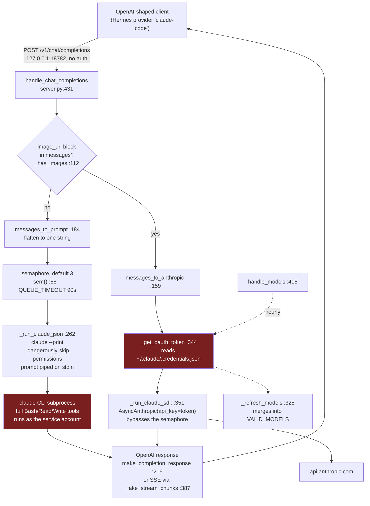

# claude-code-api - Standard Operating Procedures

An OpenAI-compatible HTTP shim in front of the `claude` CLI, so any OpenAI-shaped
client can run inference on a Claude Code subscription instead of a metered API key.
Single-file aiohttp server, loopback only. On the maintainer's fleet its one consumer
is Hermes, which lists it as the `claude-code` provider.

This SOP is deliberately short. The service is one ~570-line Python file with three
routes and no database, no queue broker, and no test suite. Padding it to match a
larger service's SOP would mean inventing procedure that does not exist.

## 1. Overview

**What it owns.** Accepting OpenAI `chat/completions` requests on loopback,
flattening them into a prompt, spawning `claude --print` under a concurrency cap,
and reshaping the result into OpenAI JSON or SSE. Plus a model list that
self-refreshes from the Anthropic API.

**What it explicitly does NOT do.**

- **No authentication or authorization of any kind.** Not a gap to be fixed later in
  this document: there is no code path anywhere in the repo that inspects a header,
  token, or origin. See [`SECURITY.md`](SECURITY.md), which is not optional reading.
- **No tool-call passthrough.** Tools execute inside Claude Code. A client cannot
  drive or observe them through the OpenAI format.
- **No conversation state.** Every call passes `--no-session-persistence`.
- **No token accounting of its own.** `usage` is whatever the CLI reports, else zero.
- **No TLS, no proxying, no multi-tenancy, no rate limiting** beyond the semaphore.

## 2. Architecture



The two red boxes are the whole security story: a request body reaches a subprocess
with permissions disabled, and a live OAuth token is read off disk on the vision and
discovery paths.

### Start here

| File | What it is |
|---|---|
| `server.py` | **The service.** Everything runs from here. Config constants are at the top (`:35-53`); read those first. |
| `server.py:431` `handle_chat_completions` | The only interesting handler. The `vision` branch at `:444` is where the two very different execution paths fork. |
| `server.py:262` `_run_claude_json` | The subprocess call. The argv at `:271-283` is the security posture in eight lines. |
| `claude-code-api.service` | The systemd **user** unit. Deploy is "copy this and enable it". |
| `server.js` | **Legacy, not deployed.** The original Node implementation, kept for reference and behind on models and features. Do not assume a fix here reaches production. |

## 3. Build

N/A - there is no build step. `server.py` is run directly by the interpreter.

Dependencies, both required at import time:

```bash
pip install aiohttp anthropic
```

`anthropic` is not optional even if you never send an image: it is imported at module
scope (`server.py:32`) and used by hourly model discovery.

`server.js` (legacy) would need `npm install` for `express`. Nothing in the deployed
path uses it.

## 4. Test

N/A - **there is no automated test suite and no CI that runs the server.**
`package.json` `scripts.test` is still the `npm init` placeholder
(`echo "Error: no test specified" && exit 1`). Do not cite CI as a gate for this
repository: the only workflows are `secret-scan` and `docs-check`, and neither
executes the server.

That is a real gap. Until it is closed, the release gate is manual. Run all four
after any change to `server.py` and paste the output into the pull request:

```bash
# 1. It imports and the routes are wired.
python3 -c "import server; a = server.build_app(); print(sorted(r.resource.canonical for r in a.router.routes()))"

# 2. It starts and answers.
python3 server.py --port 18999 &
curl -sf http://127.0.0.1:18999/health && echo
curl -sf http://127.0.0.1:18999/v1/models | head -c 200 && echo

# 3. A real completion round-trips.
curl -s --max-time 300 -X POST http://127.0.0.1:18999/v1/chat/completions \
  -H 'Content-Type: application/json' \
  -d '{"model":"claude-haiku-4-5","messages":[{"role":"user","content":"Reply with exactly: OK"}]}' \
  | python3 -c "import json,sys; print(json.load(sys.stdin)['choices'][0]['message']['content'])"

# 4. Streaming terminates properly.
curl -s --max-time 300 -N -X POST http://127.0.0.1:18999/v1/chat/completions \
  -H 'Content-Type: application/json' \
  -d '{"model":"claude-haiku-4-5","messages":[{"role":"user","content":"Count to three."}],"stream":true}' \
  | tail -3   # must end with: data: [DONE]

kill %1
```

Use a scratch port, not 18782, so you do not fight the live unit.

## 5. Release / Deploy

There is no published package and no release artifact. Deploy is "the working tree
is the deployment": the unit runs `server.py` out of a git checkout.

```bash
# Deploy
cd ~/clawd/skcapstone-repos/claude-code-api
git pull --ff-only
systemctl --user restart claude-code-api
systemctl --user status claude-code-api --no-pager
curl -sf http://127.0.0.1:18782/health && echo

# Rollback: the checkout IS the artifact, so rolling back is a git operation.
git log --oneline -5
git checkout <last-good-sha>       # detached HEAD is fine and is the point
systemctl --user restart claude-code-api
curl -sf http://127.0.0.1:18782/health && echo
# then: git checkout main   once a real fix has landed
```

The unit is `Restart=always` with escalating backoff (`RestartSteps=8`,
`RestartMaxDelaySec=5min`) and **no** `StartLimitBurst`, so a broken `ExecStart`
retries indefinitely rather than stopping. After any deploy that changes a path,
watch `journalctl --user -u claude-code-api -f` rather than trusting `restart` to
have succeeded.

Restarting drops in-flight requests. There is no graceful drain.

### Front-end / Exposure

| Property | Value |
|---|---|
| Tier | Internal helper. Not a front-end service. |
| Bind address | **`127.0.0.1` only.** Default in `server.py:546`; confirmed live with `ss -tlnp` showing `LISTEN 127.0.0.1:18782`. |
| Port | 18782 |
| Public `:443` routes | **None.** It is not behind Caddy, Cloudflare, or a tunnel, and it must not be. |
| Authentication | **None.** The loopback bind is the entire access control. |
| Consumers | Hermes, via `~/.hermes/config.yaml` provider `claude-code`, `base_url: http://127.0.0.1:18782/v1`, empty `api_key`. |

`--host` exists and will happily bind `0.0.0.0`. Exposing this port is equivalent to
publishing a remote shell. See [`SECURITY.md`](SECURITY.md).

## 6. Configuration / Usage

Configuration is CLI flags plus two environment variables. There is no config file.

| Setting | Kind | Default | Effect |
|---|---|---|---|
| `--port` | flag | 18782 | Listen port. Note `/health` reports the constant, not this. |
| `--host` | flag | `127.0.0.1` | Bind address. Leave it. |
| `--debug` | flag | off | Debug logging, including prompt sizes. |
| `CCAPI_MAX_CONCURRENT` | env | 3 | Concurrent `claude` subprocesses. Read once, on first use. |
| `CLAUDE_API_LOAD_MCP` | env | unset | `1`/`true`/`yes` boots the host's MCP servers in every subprocess. Doubles latency and widens the blast radius. A security setting. |

`REQUEST_TIMEOUT` (1800 s) and `QUEUE_TIMEOUT` (90 s) are module constants at
`server.py:41-42`, not environment variables. Changing them is a code change.

### Live deployment on noroc2027 (verified 2026-08-15)

- Unit: `~/.config/systemd/user/claude-code-api.service`, `active` and `enabled`.
- Effective `ExecStart`:
  `/home/cbrd21/.skenv/bin/python3 /home/cbrd21/clawd/skcapstone-repos/claude-code-api/server.py --port 18782`
- Drop-ins: `concurrency.conf` (`CCAPI_MAX_CONCURRENT=3`) and `restart-storm.conf`
  (`RestartSteps=8`, `RestartMaxDelaySec=5min`).
- Listening: `LISTEN 127.0.0.1:18782`.

**Known drift, needs an operator pass:** the live unit's
`Documentation=file:///home/cbrd21/clawd/skcapstone-repos/skcapstone/docs/CLAUDE-CODE-API.md`
points at a file that **does not exist**. The version of `claude-code-api.service` in
this repository has been corrected to point at this SOP, but copying it over the live
unit is an operator action and has not been done:

```bash
cp claude-code-api.service ~/.config/systemd/user/   # review the ExecStart path first
systemctl --user daemon-reload && systemctl --user restart claude-code-api
```

## 7. API / Reference

Three handlers, each also registered without the `/v1` prefix (`server.py:531-540`).

| Route | Returns |
|---|---|
| `POST /v1/chat/completions` | OpenAI chat completion, or `text/event-stream` SSE ending `data: [DONE]` when `stream: true`. Errors: HTTP 500 `{"error": {...}}`, or a single error frame mid-stream. |
| `GET /v1/models` | `{"object": "list", "data": [...]}`. Seeded from `VALID_MODELS` (`server.py:44-51`) and refreshed from the Anthropic API at most hourly. |
| `GET /health` | `{"status": "ok", "service": "claude-code-api", "port": 18782}`. **`port` is the module constant, not `--port`.** |

Model names are normalised by `normalise_model` (`server.py:99`): explicit aliases
first (`gpt-4` and `opus` map to `claude-opus-4-8`, `gpt-4o` and `sonnet` to
`claude-sonnet-4-6`, `gpt-4o-mini` / `gpt-3.5-turbo*` / `haiku` to
`claude-haiku-4-5`), then any `prefix/model` has its prefix stripped. An unknown name
**logs a warning and silently falls back to `DEFAULT_MODEL`** rather than returning an
error, so a typo produces an answer from the wrong model. Check the journal if a
response looks unexpectedly strong or weak.

## 8. Troubleshooting

| Symptom | Check |
|---|---|
| Connection refused on 18782 | `systemctl --user is-active claude-code-api`; then `ss -tlnp \| grep 18782`. If active but not listening, the port is taken: `journalctl --user -u claude-code-api -n 50`. |
| Unit flaps or restarts forever | `journalctl --user -u claude-code-api -n 100`. `Restart=always` with no `StartLimitBurst` means a bad `ExecStart` path retries forever instead of failing loudly. Verify the file exists at the effective `ExecStart` path: `systemctl --user show claude-code-api -p ExecStart`. |
| Every request 500s with `claude exited <n>` | The CLI itself is failing. Reproduce outside the server: `claude --print --model claude-haiku-4-5 <<< hi`. Usually auth: re-authenticate the CLI. |
| Requests hang, then fail after ~90 s | Semaphore starvation. All `CCAPI_MAX_CONCURRENT` slots are held by long calls and yours hit `QUEUE_TIMEOUT`. `journalctl` shows the concurrency at startup. Raise the drop-in value or reduce load. |
| A single request pins the box for 30 min | That is `REQUEST_TIMEOUT = 1800`. Working as designed. Kill the subprocess or restart the unit. |
| Answers come from the wrong model | `normalise_model` fell back to `DEFAULT_MODEL` for an unrecognised name. `journalctl --user -u claude-code-api \| grep "Unknown model"`. |
| `/health` reports port 18782 but you started it elsewhere | Known wart: the handler returns the module constant. Trust `ss -tlnp`. |
| `/v1/models` is missing a new model | Discovery is hourly and fails soft. `journalctl --user -u claude-code-api \| grep "Model discovery"`. A failure falls back to the static seed list. |
| Requests suddenly 3x slower | Check whether `CLAUDE_API_LOAD_MCP` got set. Booting MCP servers per spawn was the original behaviour and roughly doubles latency. |
| Vision requests fail while text works | The SDK path, not the CLI path. It reads `~/.claude/.credentials.json`: confirm the file is present, `0600`, and that `claudeAiOauth.accessToken` has not expired. |
| A change to `server.js` had no effect | `server.js` is not deployed. Nothing runs it. Change `server.py`. |

## 9. Maturity tier and version reference

**Maturity: personal / internal helper.** Public repository, single maintainer, no
test suite, no CI that executes the code, no release process, no published package,
and no authentication. It is a load-bearing part of one person's fleet, not a product.
Do not deploy it anywhere you would not deploy an unauthenticated shell.

**Version: do not quote a number from this repo; both sources disagree.**
`package.json` says `1.0.0` and has never been bumped. Git tags run `v1.1.0`,
`v1.1.1`, `v1.1.2`, `v1.4.0`, `v1.4.1` (with `1.2.x` and `1.3.x` never tagged), and
the tip is 7 commits past `v1.4.1`. There are no GitHub releases. The git tag is the
closest thing to a real version; `package.json` is stale. Reconciling them is tracked
in [`CHANGELOG.md`](CHANGELOG.md#versioning).

**Runtime versions in the verified deployment:** Python from `~/.skenv`, `aiohttp`
3.13.3, `anthropic` 0.84.0.

## Unverified / needs an operator pass

- **The live unit's `Documentation=` is a dead path.** Corrected in the repo copy,
  not yet applied to `~/.config/systemd/user/`. Command in section 6.
- **`package.json` version drift.** Left alone deliberately; picking a number is a
  maintainer decision, not a documentation one.
- **`server.js` is believed dead, not proven dead.** Verified on noroc2027 only: no
  node process running it, no systemd unit referencing it, and `/opt/claude-code-api`
  (the path its old unit named) does not exist. If it runs somewhere else, this SOP
  does not know about it.
- **No load, latency, or throughput figures are given** because none have been
  measured. The `~6s -> ~3s` figure in commit `818c3a2` is the author's note, not a
  benchmark this document reproduced.
- **No test suite exists**, so section 4 is a manual checklist. Nothing mechanically
  blocks a broken `server.py` from being deployed.

<!-- docs-evidence
verified: 2026-08-15
checks:
  - name: documented listen port matches the server constant
    run: grep -qx 'PORT = 18782' server.py
  - name: documented default model matches the server constant
    run: grep -qx 'DEFAULT_MODEL = "claude-opus-4-8"' server.py
  - name: documented /health payload shape matches the handler
    run: grep -qE '^\s*return web\.json_response\(\{"status": "ok", "service": "claude-code-api", "port": PORT\}\)' server.py
  - name: documented OAuth credential path matches the constant
    run: grep -qx 'CREDS_PATH = os.path.expanduser("~/.claude/.credentials.json")' server.py
  - name: SECURITY.md permission-bypass claim still matches the spawned argv
    run: grep -qE '^\s*"--dangerously-skip-permissions",$' server.py
  - name: documented concurrency default matches the semaphore
    run: grep -qE '^\s*n = max\(1, int\(os\.environ\.get\("CCAPI_MAX_CONCURRENT", "3"\)\)\)$' server.py
  - name: documented loopback-only default bind matches the arg parser
    run: grep -qE '^\s*parser\.add_argument\("--host", default="127\.0\.0\.1"' server.py
  - name: documented request timeout matches the constant
    run: grep -qE '^REQUEST_TIMEOUT = 1800( |$)' server.py
  - name: tracked unit ExecStart matches the documented entry point and port
    run: grep -qE '^ExecStart=.*server\.py --port 18782$' claude-code-api.service
-->
