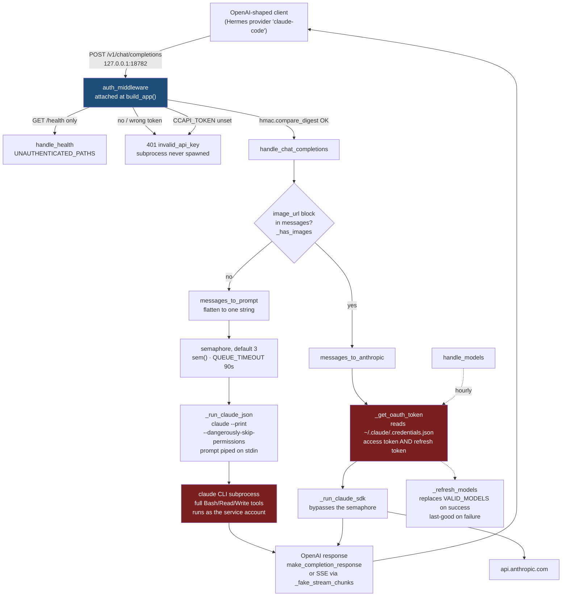

# claude-code-api - Standard Operating Procedures

An OpenAI-compatible HTTP shim in front of the `claude` CLI, so any OpenAI-shaped
client can run inference on a Claude Code subscription instead of a metered API key.
Single-file aiohttp server, loopback only. On the maintainer's fleet its one consumer
is Hermes, which lists it as the `claude-code` provider.

This SOP is deliberately short. The service is one Python file with three routes and
no database and no queue broker. Padding it to match a larger service's SOP would mean
inventing procedure that does not exist.

## 1. Overview

**What it owns.** Authenticating each request against a shared secret, accepting
OpenAI `chat/completions` requests on loopback, flattening them into a prompt,
spawning `claude --print` under a concurrency cap, and reshaping the result into
OpenAI JSON or SSE. Plus a model list that self-refreshes from the Anthropic API.

**What it does for authorization.** One shared secret, `CCAPI_TOKEN`, required on
every route except `GET /health`, presented as `Authorization: Bearer <token>` or
`X-CCAPI-Token: <token>`, compared with `hmac.compare_digest`. Unset or blank means
every authenticated route returns `401`; there is no permissive fallback. Read
[`SECURITY.md`](SECURITY.md) for the rationale and the storage and rotation
procedure. It is not optional reading.

**What it explicitly does NOT do.**

- **No identities, scopes, or per-caller audit.** One secret, one privilege level.
  Holding the token is holding the service account.
- **No tool-call passthrough.** Tools execute inside Claude Code. A client cannot
  drive or observe them through the OpenAI format.
- **No conversation state.** Every call passes `--no-session-persistence`.
- **No token accounting of its own.** `usage` is whatever the CLI reports, else zero.
- **No TLS, no proxying, no multi-tenancy, no rate limiting** beyond the semaphore.

## 2. Architecture

Symbol names, not line numbers: this file has been edited enough that pinned line
numbers go stale faster than the gate catches them. Every name below is greppable.



The two red boxes are the whole security story: a request body reaches a subprocess
with permissions disabled, and a live OAuth token plus a durable refresh token are
read off disk on the vision and discovery paths. The blue box is the only thing
standing in front of them. Until 2026-08-16 it did not exist, and the loopback bind
was the entire access control.

### OAuth and model-catalog lifecycle

`~/.claude/.credentials.json` is authoritative. Discovery and multimodal SDK
requests read its current access token on every call and send it as OAuth Bearer
authentication. CLI subprocesses explicitly remove an inherited
`CLAUDE_CODE_OAUTH_TOKEN`; otherwise a token captured by the long-running systemd
service overrides the freshly updated credential file indefinitely.

A successful, non-empty Anthropic `/v1/models` response replaces `VALID_MODELS`:
new IDs appear and absent IDs retire. A failed or empty response preserves the
last-good set. After re-authentication, restart the service to clear any old
process environment immediately, then require `model_discovery.ok=true` and an
authenticated completion before declaring the token healthy.

### Start here

| File | What it is |
|---|---|
| `server.py` | **The service.** Everything runs from here. Config constants are at the top, under `Configuration` and `Authentication`; read those first. |
| `server.py` `auth_middleware` | The gate. Attached in `build_app()` as application middleware, not per route, so a route added later is guarded by default. `UNAUTHENTICATED_PATHS` is the entire exception list. |
| `server.py` `handle_chat_completions` | The only interesting handler. The `vision` branch is where the two very different execution paths fork. |
| `server.py` `_run_claude_json` | The subprocess call. Its argv is the security posture in eight lines. |
| `test_auth.py` | What proves the gate holds, including that it fails when detached. Run by `.github/workflows/ci.yml`. |
| `claude-code-api.service` | The systemd **user** unit. Deploy is "mint the secret, copy this, enable it". |

## 3. Build

N/A - there is no build step. `server.py` is run directly by the interpreter.

Dependencies, both required at import time:

```bash
pip install aiohttp anthropic
```

`anthropic` is not optional even if you never send an image: it is imported at module
scope and used by hourly model discovery.

There is no Node component. `server.js`, `package.json`, and `package-lock.json` were
deleted on 2026-08-16.

## 4. Test

### The automated gate

`.github/workflows/ci.yml` runs `python -m unittest discover` on Python 3.11 and 3.12
on every push and pull request. It is the first workflow in this repository that
executes the code; `docs-check` reads Markdown and `secret-scan` reads git history.

```bash
pip install aiohttp anthropic
python3 -m unittest discover -v      # 20 tests
```

`test_auth.py` covers the token gate only: token unset, token blank, no credentials,
wrong token, a token that is a prefix of the right one, a token with an extra suffix,
both accepted headers, case-insensitive `Bearer`, the streaming path, and every route
including the unprefixed aliases. It stubs `_refresh_models` and `_run_claude_json`,
so it makes no network call, spawns no subprocess, and reads no credentials file.

The CI job also carries a **negative control**: it detaches the middleware from
`build_app()` and asserts the suite goes red. A gate that has never been observed
failing is not known to be a gate, and this one is the only thing between a local
process and arbitrary code execution.

### What is still manual

Everything except auth. The request-translation, streaming, vision, and model
discovery paths have no automated coverage, because exercising them means calling the
real `claude` CLI. Run these after any change to `server.py` and paste the output into
the pull request. Use a scratch port, not 18782, so you do not fight the live unit:

```bash
export CCAPI_TOKEN="$(python3 -c 'import secrets;print(secrets.token_urlsafe(32))')"

# 1. It imports and the routes are wired.
python3 -c "import server; a = server.build_app(); print(sorted(r.resource.canonical for r in a.router.routes()))"

# 2. It starts and answers. /health needs no token; /v1/models does.
python3 server.py --port 18999 &
curl -sf http://127.0.0.1:18999/health && echo
curl -sf http://127.0.0.1:18999/v1/models -H "Authorization: Bearer $CCAPI_TOKEN" | head -c 200 && echo

# 3. Auth is live end to end. Want 401, then 200.
curl -s -o /dev/null -w '%{http_code}\n' -X POST http://127.0.0.1:18999/v1/chat/completions \
  -H 'Content-Type: application/json' -d '{"model":"claude-haiku-4-5","messages":[{"role":"user","content":"hi"}]}'

# 4. A real completion round-trips.
curl -s --max-time 300 -X POST http://127.0.0.1:18999/v1/chat/completions \
  -H "Authorization: Bearer $CCAPI_TOKEN" -H 'Content-Type: application/json' \
  -d '{"model":"claude-haiku-4-5","messages":[{"role":"user","content":"Reply with exactly: OK"}]}' \
  | python3 -c "import json,sys; print(json.load(sys.stdin)['choices'][0]['message']['content'])"

# 5. Streaming terminates properly.
curl -s --max-time 300 -N -X POST http://127.0.0.1:18999/v1/chat/completions \
  -H "Authorization: Bearer $CCAPI_TOKEN" -H 'Content-Type: application/json' \
  -d '{"model":"claude-haiku-4-5","messages":[{"role":"user","content":"Count to three."}],"stream":true}' \
  | tail -3   # must end with: data: [DONE]

kill %1
```

## 5. Release / Deploy

There is no published package and no release artifact. Deploy is "the working tree
is the deployment": the unit runs `server.py` out of a git checkout.

### One-time cutover to the authenticated build

**Read this before the first `git pull` that brings in the token gate.** The order
matters: the moment the new `server.py` is running, any consumer that does not send
the secret gets `401`. On the maintainer's fleet that consumer is Hermes, which today
sends `Authorization: Bearer no-key-required` because `api_key` in
`~/.hermes/config.yaml` is `''`.

```bash
# 1. Mint the secret and store it 0600, OUTSIDE the checkout.
umask 077
printf 'CCAPI_TOKEN=%s\n' "$(python3 -c 'import secrets;print(secrets.token_urlsafe(32))')" \
  > ~/.config/claude-code-api.env
chmod 600 ~/.config/claude-code-api.env

# 2. Teach the unit to read it. The repo copy already has the EnvironmentFile line,
#    so this is the same "copy the unit" step as any other unit change. Review the
#    ExecStart path before overwriting.
cd ~/clawd/skcapstone-repos/claude-code-api
cp claude-code-api.service ~/.config/systemd/user/
systemctl --user daemon-reload

# 3. Point the consumer at the same secret BEFORE the server starts refusing it.
#    Hermes: set api_key on the claude-code provider in ~/.hermes/config.yaml to
#    ${CCAPI_TOKEN}, and put CCAPI_TOKEN=<same value> in ~/.hermes/.env. Hermes hands
#    api_key to the OpenAI SDK, which sends Authorization: Bearer. Do NOT use a
#    global default_headers entry: it would send this secret to every other provider.

# 4. Now pull and restart.
git pull --ff-only
systemctl --user restart claude-code-api

# 5. Verify, in this order.
curl -s http://127.0.0.1:18782/health                     # want "auth": "required"
curl -s -o /dev/null -w '%{http_code}\n' \
  http://127.0.0.1:18782/v1/models                        # want 401
curl -s -o /dev/null -w '%{http_code}\n' \
  -H "Authorization: Bearer $(. ~/.config/claude-code-api.env; echo "$CCAPI_TOKEN")" \
  http://127.0.0.1:18782/v1/models                        # want 200

# 6. Restart the consumer and confirm it still gets answers.
systemctl --user restart hermes-gateway     # if that is how it runs
journalctl --user -u claude-code-api -n 30  # look for 401s from a consumer you forgot
```

If `/health` reports `"auth": "unconfigured"` after step 4, the unit is not reading the
env file: check `systemctl --user show claude-code-api -p EnvironmentFiles` and that
the file exists and is readable. The service is fail-closed in that state, so nothing
is exposed while you fix it, but nothing works either.

### Ordinary deploy

```bash
cd ~/clawd/skcapstone-repos/claude-code-api
git pull --ff-only
systemctl --user restart claude-code-api
systemctl --user status claude-code-api --no-pager
curl -sf http://127.0.0.1:18782/health && echo

# Rollback: the checkout IS the artifact, so rolling back is a git operation.
git log --oneline -5
git checkout <last-good-sha>       # detached HEAD is fine and is the point
systemctl --user restart claude-code-api
curl -sf http://127.0.0.1:18782/health && echo
# then: git checkout main   once a real fix has landed
```

The unit is `Restart=always` with escalating backoff (`RestartSteps=8`,
`RestartMaxDelaySec=5min`) and **no** `StartLimitBurst`, so a broken `ExecStart`
retries indefinitely rather than stopping. After any deploy that changes a path,
watch `journalctl --user -u claude-code-api -f` rather than trusting `restart` to
have succeeded.

Restarting drops in-flight requests. There is no graceful drain.

### Front-end / Exposure

| Property | Value |
|---|---|
| Tier | Internal helper. Not a front-end service. |
| Bind address | **`127.0.0.1` only.** Default in the `--host` argument; confirmed live with `ss -tlnp` showing `LISTEN 127.0.0.1:18782`. |
| Port | 18782 |
| Public `:443` routes | **None.** It is not behind Caddy, Cloudflare, or a tunnel, and it must not be. |
| Authentication | **Shared secret**, `CCAPI_TOKEN`, on every route except `GET /health`. Unset means everything 401s. |
| Consumers | Hermes, via `~/.hermes/config.yaml` provider `claude-code`, `base_url: http://127.0.0.1:18782/v1`. Its `api_key` must carry the secret. |

`--host` exists and will happily bind `0.0.0.0`. Do not. A shared secret is not a
reason to publish this port: it still reaches a subprocess running with permissions
disabled, over cleartext HTTP, with no rate limiting and no per-caller identity. See
[`SECURITY.md`](SECURITY.md).

## 6. Configuration / Usage

Configuration is CLI flags plus two environment variables. There is no config file.

| Setting | Kind | Default | Effect |
|---|---|---|---|
| `CCAPI_TOKEN` | env | **unset** | **The shared secret.** Required by every route except `GET /health`. Unset or whitespace-only means every authenticated route returns 401. Read per request, so it is never cached past a restart. Store it in `~/.config/claude-code-api.env` at `0600`; never in the unit, never in the repo. |
| `--port` | flag | 18782 | Listen port. Note `/health` reports the constant, not this. |
| `--host` | flag | `127.0.0.1` | Bind address. Leave it. |
| `--debug` | flag | off | Debug logging, including prompt sizes. Does not log tokens. |
| `CCAPI_MAX_CONCURRENT` | env | 3 | Concurrent `claude` subprocesses. Read once, on first use. |
| `CLAUDE_API_LOAD_MCP` | env | unset | `1`/`true`/`yes` boots the host's MCP servers in every subprocess. Doubles latency and widens the blast radius. A security setting. |

`REQUEST_TIMEOUT` (1800 s), `QUEUE_TIMEOUT` (90 s), and `HEALTH_ERROR_MAX_CHARS` (200)
are module constants near the top of `server.py`, not environment variables. Changing
them is a code change.

### Live deployment on noroc2027 (verified 2026-08-16)

- Unit: `~/.config/systemd/user/claude-code-api.service`, `active` and `enabled`.
- Effective `ExecStart`:
  `/home/cbrd21/.skenv/bin/python3 /home/cbrd21/clawd/skcapstone-repos/claude-code-api/server.py --port 18782`
- Drop-ins: `concurrency.conf` (`CCAPI_MAX_CONCURRENT=3`) and `restart-storm.conf`
  (`RestartSteps=8`, `RestartMaxDelaySec=5min`).
- Listening: `LISTEN 127.0.0.1:18782`.

**Known drift, needs an operator pass.** Both are operator actions that this branch
cannot perform, and both are covered by the cutover in section 5:

1. **The live service is still the unauthenticated build.** It is running the
   pre-cutover `server.py` out of the shared checkout. Until step 4 of the cutover, the
   loopback bind is still the entire access control.
2. **The live unit has no `EnvironmentFile` and a dead `Documentation=` path**
   (`file:///home/cbrd21/clawd/skcapstone-repos/skcapstone/docs/CLAUDE-CODE-API.md`
   does not exist). The repo copy fixes both. Copying it over is manual:

```bash
cp claude-code-api.service ~/.config/systemd/user/   # review the ExecStart path first
systemctl --user daemon-reload && systemctl --user restart claude-code-api
```

## 7. API / Reference

Three handlers, the two `/v1` ones also registered without the prefix (see
`build_app`). All four of those require the token.

| Route | Auth | Returns |
|---|---|---|
| `POST /v1/chat/completions` | **token** | OpenAI chat completion, or `text/event-stream` SSE ending `data: [DONE]` when `stream: true`. Errors: HTTP 500 `{"error": {...}}`, or a single error frame mid-stream. |
| `GET /v1/models` | **token** | `{"object": "list", "data": [...]}`. Seeded from `VALID_MODELS` and refreshed from the Anthropic API at most hourly. |
| `POST /chat/completions`, `GET /models` | **token** | Unprefixed aliases of the two above, for clients that do not add `/v1`. |
| `GET /health` | **open** | `{"status", "service", "port", "auth", "model_discovery"}`. **`port` is the module constant, not `--port`.** `auth` is `"required"` or `"unconfigured"` and never contains the secret. |

Authentication failures return **401** with an OpenAI-shaped body,
`{"error": {"message": ..., "type": "invalid_request_error", "code": "invalid_api_key"}}`,
so an OpenAI-compatible client reports an auth problem rather than a generic server
error. The `message` distinguishes three cases: `CCAPI_TOKEN` unset on the server
(and names the variable), no credentials presented, and a token mismatch.

Model names are normalised by `normalise_model`: explicit aliases first (`gpt-4` and
`opus` map to `claude-opus-5`, `gpt-4o` and `sonnet` to `claude-sonnet-5`, `fable` to
`claude-fable-5`, `gpt-4o-mini` / `gpt-3.5-turbo*` / `haiku` to `claude-haiku-4-5`),
then any `prefix/model` has its prefix stripped. An unknown name **logs a warning and
silently falls back to `DEFAULT_MODEL`** rather than returning an error, so a typo
produces an answer from the wrong model. Check the journal if a response looks
unexpectedly strong or weak.

## 8. Troubleshooting

| Symptom | Check |
|---|---|
| **Every request 401s, `/health` says `"auth": "unconfigured"`** | The server has no `CCAPI_TOKEN`. This is fail-closed on purpose, not a crash. `systemctl --user show claude-code-api -p EnvironmentFiles` (want `~/.config/claude-code-api.env`), then confirm the file exists, is `0600`, is readable by the service user, and has a non-blank value. `daemon-reload` and restart after fixing. |
| **Every request 401s, `/health` says `"auth": "required"`** | The server is configured and the **client** is not, or is sending the wrong value. `journalctl --user -u claude-code-api \| grep 401` distinguishes "no credentials presented" from "token mismatch". For Hermes, check `api_key` on the `claude-code` provider in `~/.hermes/config.yaml` and that `${CCAPI_TOKEN}` resolves from `~/.hermes/.env`. |
| A client that used to work started 401ing after a deploy | The token gate landed. That is this change. Follow the cutover in section 5; the consumer needs the secret. Hermes shipped `api_key: ''`, which the OpenAI SDK sends as `Bearer no-key-required`. |
| Secret rotated, some caller still broken | There is no dual-token grace window. Every consumer must be updated in the same maintenance window as the env file. Grep the journal for 401s to find the one you forgot. |
| Connection refused on 18782 | `systemctl --user is-active claude-code-api`; then `ss -tlnp \| grep 18782`. If active but not listening, the port is taken: `journalctl --user -u claude-code-api -n 50`. |
| Unit flaps or restarts forever | `journalctl --user -u claude-code-api -n 100`. `Restart=always` with no `StartLimitBurst` means a bad `ExecStart` path retries forever instead of failing loudly. Verify the file exists at the effective `ExecStart` path: `systemctl --user show claude-code-api -p ExecStart`. |
| Every request 500s with `claude exited <n>` | The CLI itself is failing. Reproduce outside the server: `claude --print --model claude-haiku-4-5 <<< hi`. Usually auth: re-authenticate the CLI. |
| Requests hang, then fail after ~90 s | Semaphore starvation. All `CCAPI_MAX_CONCURRENT` slots are held by long calls and yours hit `QUEUE_TIMEOUT`. `journalctl` shows the concurrency at startup. Raise the drop-in value or reduce load. |
| A single request pins the box for 30 min | That is `REQUEST_TIMEOUT = 1800`. Working as designed. Kill the subprocess or restart the unit. |
| Answers come from the wrong model | `normalise_model` fell back to `DEFAULT_MODEL` for an unrecognised name. `journalctl --user -u claude-code-api \| grep "Unknown model"`. |
| `/health` reports port 18782 but you started it elsewhere | Known wart: the handler returns the module constant. Trust `ss -tlnp`. |
| `/v1/models` is missing a new model | Discovery is hourly and fails soft. `journalctl --user -u claude-code-api \| grep "Model discovery"`, or read `model_discovery` on `/health`. A failure falls back to the static seed list. |
| Requests suddenly 3x slower | Check whether `CLAUDE_API_LOAD_MCP` got set. Booting MCP servers per spawn was the original behaviour and roughly doubles latency. |
| Vision requests fail while text works | The SDK path, not the CLI path. It reads `~/.claude/.credentials.json`: confirm the file is present, `0600`, and that `claudeAiOauth.accessToken` has not expired. |
| Looking for `server.js` | Deleted 2026-08-16 along with `package.json` and `package-lock.json`. It was never deployed and never had the token gate. `git log -- server.js`. |

## 9. Maturity tier and version reference

**Maturity: personal / internal helper.** Public repository, single maintainer, no
release process, no published package, and authentication that is one shared secret
with no identities. Test coverage exists for the auth gate only. It is a load-bearing
part of one person's fleet, not a product. Do not deploy it anywhere you would not
deploy a shell that anyone holding one password can use.

**Version: do not quote a number from this repo.** `package.json` was the other
claimant and was deleted on 2026-08-16 along with the Node implementation it
described, so git tags are now the only source. They run `v1.1.0`, `v1.1.1`,
`v1.1.2`, `v1.4.0`, `v1.4.1` (with `1.2.x` and `1.3.x` never tagged), and the tip is
well past `v1.4.1`. There are no GitHub releases and no automation derives a version
from the tag, so a tag records a point in history and nothing more. See
[`CHANGELOG.md`](CHANGELOG.md#versioning).

**Runtime versions in the verified deployment:** Python from `~/.skenv`, `aiohttp`
3.13.3, `anthropic` 0.84.0.

## Unverified / needs an operator pass

- **The token gate has never run against the live service.** Everything in section 4
  was verified in tests and against a scratch port. The live unit on noroc2027 was
  deliberately not restarted by the branch that added this, so the cutover in
  section 5 is an untested-in-production procedure written from the code, and the
  Hermes side of it has not been exercised at all.
- **The live unit is still the unauthenticated build**, and still has the dead
  `Documentation=` path and no `EnvironmentFile`. Corrected in the repo copy only.
  Commands in sections 5 and 6.
- **Consumers other than Hermes are not enumerated.** Hermes is the only one this
  document has confirmed. Anything else on the box that speaks to `127.0.0.1:18782`
  will start getting 401s at cutover and nobody has grepped for it. `journalctl` after
  the restart is the practical way to find out.
- **Auth is the only tested path.** The request-translation, streaming, vision, and
  discovery paths still have no automated coverage, so nothing mechanically blocks a
  broken `server.py` from being deployed as long as its 401s are correct.
- **No load, latency, or throughput figures are given** because none have been
  measured. The `~6s -> ~3s` figure in commit `818c3a2` is the author's note, not a
  benchmark this document reproduced.

<!-- docs-evidence
verified: 2026-08-16
checks:
  - name: the auth middleware is actually attached to the app
    run: grep -qE '^\s*app = web\.Application\(middlewares=\[auth_middleware\]\)$' server.py
  - name: documented token env var name matches the server constant
    run: grep -qx 'CCAPI_TOKEN_ENV = "CCAPI_TOKEN"' server.py
  - name: documented custom auth header name matches the server constant
    run: grep -qx 'AUTH_HEADER = "X-CCAPI-Token"' server.py
  - name: only GET /health is documented and coded as unauthenticated
    run: grep -qx 'UNAUTHENTICATED_PATHS = frozenset({"/health"})' server.py
  - name: the token comparison is constant-time, not ==
    run: grep -qE '^\s*if not hmac\.compare_digest\(presented\.encode\("utf-8"\), expected\.encode\("utf-8"\)\):$' server.py
  - name: Authorization Bearer is still accepted, as the Hermes cutover depends on it
    run: grep -qE '^\s*if authz\[:7\]\.lower\(\) == "bearer ":$' server.py
  - name: an unset token still refuses, so no default-open fallback crept back in
    run: grep -qE '^\s*expected = expected_token\(\)$' server.py && grep -qE '^\s*if not expected:$' server.py
  - name: the tracked unit carries no secret and reads one from an env file
    run: grep -qE '^EnvironmentFile=-%h/\.config/claude-code-api\.env$' claude-code-api.service && ! grep -qE '^Environment=CCAPI_TOKEN' claude-code-api.service
  - name: the auth test suite exists and CI executes it
    run: test -f test_auth.py && grep -q 'python -m unittest discover -v' .github/workflows/ci.yml
  - name: CI still negative-controls the gate by detaching the middleware
    run: grep -q 'web.Application()' .github/workflows/ci.yml
  - name: the deleted Node implementation has stayed deleted
    run: test ! -e server.js && test ! -e package.json
  - name: documented listen port matches the server constant
    run: grep -qx 'PORT = 18782' server.py
  - name: documented default model matches the server constant
    run: grep -qx 'DEFAULT_MODEL = "claude-opus-5"' server.py
  - name: documented /health auth field matches the handler
    run: grep -qE '^\s*"auth": "required" if expected_token\(\) else "unconfigured",$' server.py
  - name: documented OAuth credential path matches the constant
    run: grep -qx 'CREDS_PATH = os.path.expanduser("~/.claude/.credentials.json")' server.py
  - name: SECURITY.md permission-bypass claim still matches the spawned argv
    run: grep -qE '^\s*"--dangerously-skip-permissions",$' server.py
  - name: documented concurrency default matches the semaphore
    run: grep -qE '^\s*n = max\(1, int\(os\.environ\.get\("CCAPI_MAX_CONCURRENT", "3"\)\)\)$' server.py
  - name: documented loopback-only default bind matches the arg parser
    run: grep -qE '^\s*parser\.add_argument\("--host", default="127\.0\.0\.1"' server.py
  - name: documented request timeout matches the constant
    run: grep -qE '^REQUEST_TIMEOUT = 1800( |$)' server.py
  - name: documented health error truncation matches the constant
    run: grep -qE '^HEALTH_ERROR_MAX_CHARS = 200( |$)' server.py
  - name: tracked unit ExecStart matches the documented entry point and port
    run: grep -qE '^ExecStart=.*server\.py --port 18782$' claude-code-api.service
-->
